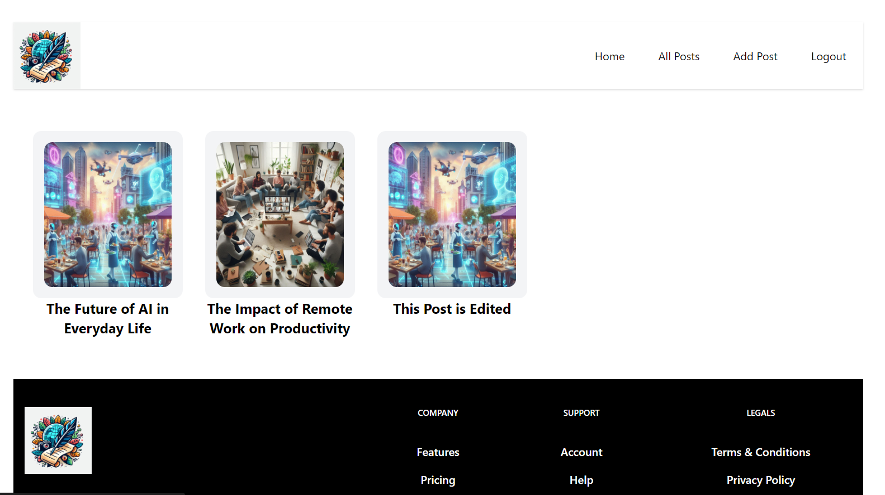
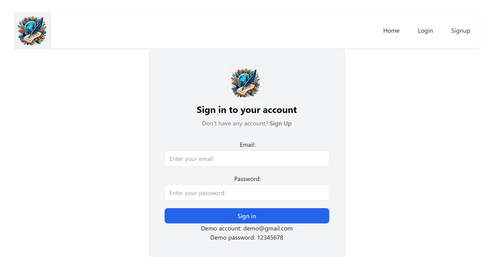
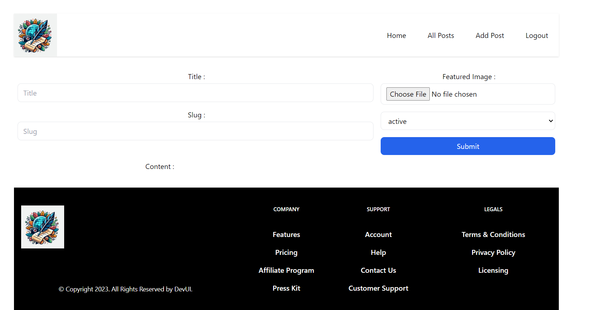
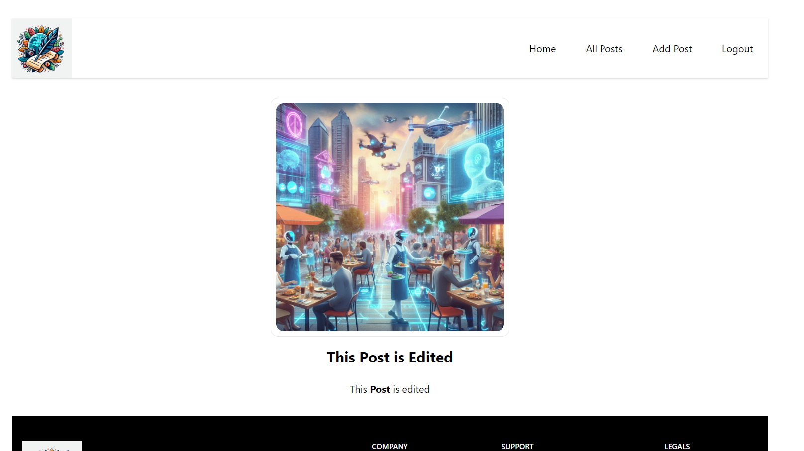

# Blogging Web Application


A **full-featured blogging platform** that allows users to create, edit, and delete blog posts while managing authentication and user data. Built with modern tools to enhance content creation and user interaction.


## Features

- **Blog Management**: Users can create, edit, and delete blog posts seamlessly, improving user experience and interaction.
- **Secure Backend**: Integrated **Appwrite** for authentication and database management, ensuring secure user login and data storage.
- **State Management**: Utilized **Redux Toolkit** for efficient state management, ensuring a smooth data flow between components and enhancing application performance.
- **Responsive Design**: Fully responsive design built with **TailwindCSS**, providing a great experience across different devices.


## Tech Stack

- **Frontend**: React, TailwindCSS
- **State Management**: Redux Toolkit
- **Backend**: Appwrite (BaaS)
- **Deployment**: Vercel

## Screenshots







## Run Locally

Clone the project

```bash
  git clone https://github.com/Uzairkazi695/react-blogging-app.git
```

Go to the project directory

```bash
  cd react-blogging-app
```

Install dependencies

```bash
  npm install
```

Start the server

```bash
  npm run dev
```


## Environment Variables

To run this project, you will need to add the following environment variables to your .env file

`VITE_APPWRITE_URL`

`VITE_APPWRITE_PROJECT_ID `

`VITE_APPWRITE_DATABASE_ID `

`VITE_APPWRITE_COLLECTION_ID`

`VITE_APPWRITE_BUCKET_ID `

`VITE_TINYMCE_API_KEY`


## Future Enhancements

- **Comment System**: Implement a comment system to allow users to interact with blog posts.

- **Like & Share**: Add features to allow users to like and share blog posts on social media.

- **Post Categories**: Enable post categorization for easier content navigation.


## Contributing

Contributions are always welcome!


## License

This project is licensed under the [MIT](https://choosealicense.com/licenses/mit/) License. 

